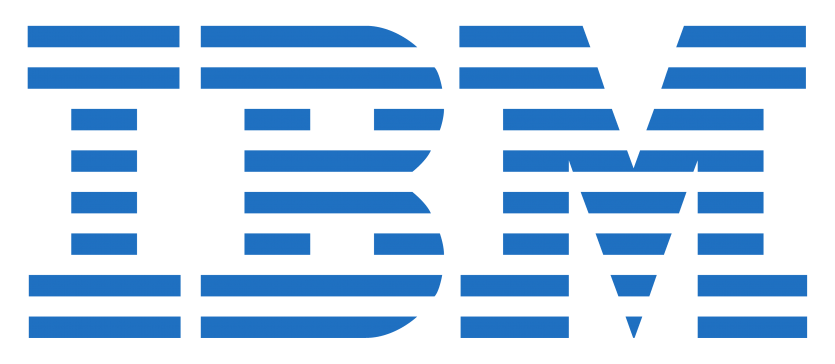

      

# Introduction to Cybersecurity Tools Cyber Attacks
**This course gives you the background needed to understand basic Cybersecurity.  You will learn the history of Cybersecurity, types and motives of cyber attacks to further your knowledge of current threats to organizations and individuals.  Key terminology, basic system concepts and tools will be examined as an introduction to the Cybersecurity field.**

**You will learn about critical thinking and its importance to anyone looking to pursue a career in Cybersecurity.**

**Finally, you will begin to learn about organizations and resources to further research cybersecurity issues in the Modern era.**

**This course is intended for anyone who wants to gain a basic understanding of Cybersecurity or as the first course in a series of courses to acquire the skills to work in the Cybersecurity field as a Jr Cybersecurity Analyst**

  

## 📓 My Notes 

| Week  |                        Content                        | My Notes |
|-------|:-----------------------------------------------------:|----------|
| One   | History of Cybersecurity                              | [Link](https://www.notion.so/Study-Introduction-to-CyberSecurity-Week-1-b527db23ece849edb83552051c4f1da4)     |
| Two   | A brief overview of types of actors and their motives | Link     |
| Three | An overview of key security concepts                  | Link     |
| Four  | An overview of key security tools                     | Link     |
